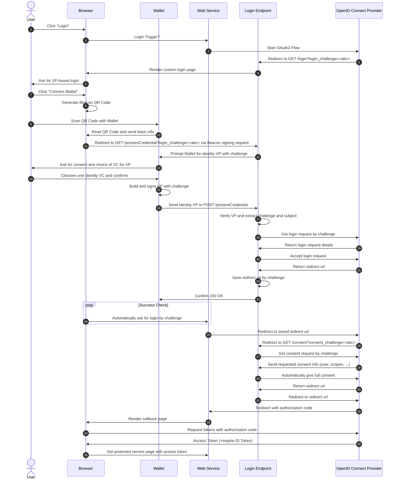

# Gaia-X Credentials Bridge

> [!WARNING]
> This repository is in early development and not feature complete.

## Overview

This bridge allows you to use established OIDC flows to authenticate and authorize users that have W3C Verifiable Credentials. As a contribution to Gaia-X infrastructure, the ultimate goal here is to enable users to use their GX Participant Credential to access systems while making integration simpler through using established SSO protocols.


## Architecture

There are two main components to this project and a lot of additional containers for monitoring and databases. A company (or at least a small consortium) wanting to support SSI in their existing (or new) systems, is expected to run this full setup to avoid introducing a middle man.

### OIDC Provider: Ory Hydra

Hydra is a FOSS and OpenID certified implementation. It should allow any OIDC or OAuth2 client to leverage it as an IdP. For development, it has the advantage of giving us freedom to build a custom login process, as we can specify arbitrary redirects.

### VC Login Service

This custom Next.js web app provides a user frontend for the login process, as well as necessary backend API routes. It handles the wallet connection, the Verifiable Presentaiton exchange, the verification


## Flow

The user starts out on the service website. Redirects (mostly) omit the middle step of returning to the browser for readability. Wallet still uses Beacon Protocol, but should ultimately use OpenID4VP.




## Development Roadmap

While the repository already demonstrates a working front-to-back flow, here are some pointers to the main features still missing:
- support for real GX Participant Credentials and their proper verification
- a trusted issuer list and possibly access policies
- OpenID4VP support


## Running it for testing

1. `$ ngrok http 5002` and enter the domain into the compose file for the vclogin
2. `$ docker compose up`
3. `$ ./test_client.sh`
4. Go to `http://localhost:9010`
5. Download Altme Wallet and setup new account
6. Follow the login flow and present your Account Ownership VC generated on Altme startup
7. End up at `http://localhost:9010/callback` with metadata about the login being displayed


## Token Introspection

Look into the access token like this:

```
$ docker run --rm -it \
    --network ory-hydra-net \
    oryd/hydra:v2.2.0 \
    introspect token --skip-tls-verify \
    --format json-pretty \
    -e http://hydra:4445 \
    TOKEN
```

Example result:

```
{
  "active": true,
  "client_id": "92cb2457-a125-4b41-af31-39a739ccdf19",
  "exp": 1699045032,
  "iat": 1699041432,
  "iss": "http://localhost:5004/",
  "nbf": 1699041432,
  "sub": "did:pkh:tz:tz1Nm5krcMJA899MVKDUUJU5N2torXj3UsPQ",
  "token_type": "Bearer",
  "token_use": "access_token"
}
```