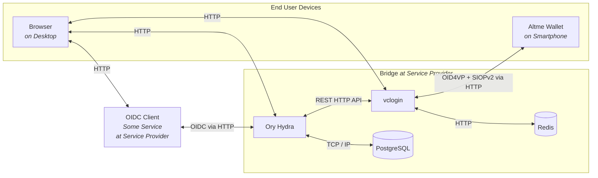
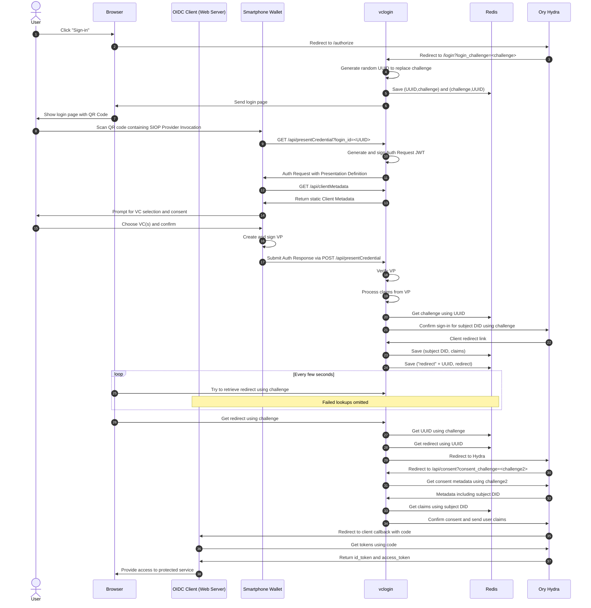
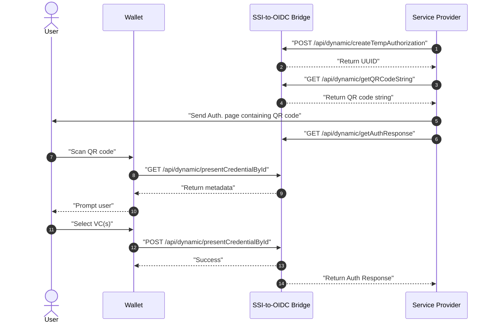

# Universal SSI-to-OIDC Bridge for VC-based Sign-ins


<!-- prettier-ignore -->
> [!WARNING]
> This repository is intended for prototyping and as a reference
> implementation. At this time, no security guarantees can be given.

<!-- prettier-ignore -->
> [!NOTE]
> A preprint of our paper providing more background information is
> available [on arXiv](https://arxiv.org/abs/2401.09488). While it is slightly
> outdated now, it provides a good introduction.

<!-- prettier-ignore -->
> [!NOTE]
> This software artifact was originally intended to support only Gaia-X
> Participant Credentials. It has since evolved to be fully configurable for
> almost any Verifiable Credential, almost any wallet application, and almost
> any current OIDC client.

## Overview

### The Problem Statement

You operate a service and want to allow your users to sign in using Verifiable
Credentials from a mobile wallet. But building that takes considerable time and
expertise.

<!-- prettier-ignore -->
> [!NOTE]
> As a new feature, the bridge now supports incremental authorization.
> This allows the service provider to request additional Verifiable Credentials
> from the user via the bridge. Please see the
> [Incremental Authorization Flow](#incremental-authorization-flow) section for
> more details.

### The Solution

A service provider can run this dockerized bridge software that acts as a normal
OIDC Provider toward the service. That means any service supporting OIDC or
OAuth 2.0 for sign-ins can immediately be upgraded to accept sign-ins with
Verifiable Credentials. When setting up the bridge software, you can configure
what Verifiable Credentials are accepted and how the data within is put into
`id_token` or `access_token`.

As a contribution to Gaia-X infrastructure, the ultimate goal here is to enable
users to use their Gaia-X Participant Credentials to access systems while making
integration simpler through the use of established SSO protocols. The bridge can
also be configured to use other Verifiable Credentials.

## Architecture

There are two main components to this project, as well as some additional
containers for monitoring and databases. A company (or at least a small
consortium) wanting to support SSI in their existing (or new) systems is
expected to run this full setup to avoid introducing a middleman:



_Note: In a deployment, external HTTP interfaces should be using HTTPS instead._
_Note: While we test with Altme Wallet, any SSI wallet supporting OID4VP +
SIOPv2 works._

### OIDC Provider: Ory Hydra

Hydra is a OpenID-certified implementation and FOSS. It should allow any OIDC or
OAuth2 client to leverage it as an IdP. For development, it has the advantage of
giving us the freedom to build a custom login process, as we can specify
arbitrary redirects.

### VC Login Service (vclogin)

This custom Next.js web app provides a user frontend for the login process, as
well as necessary backend API routes. It handles the Verifiable Presentation
exchange with the wallet, the verification of Verifiable Presentations and of
the Verifiable Credentials inside, and the extraction and remapping of claims.

## Login Flow

The user's browser starts out on the service website, which takes on the role of
an OIDC client here. The flow is slightly simplified for improved readability.
For example, the responses for Redis lookups are not shown. Also, redirects are
shown immediately going to the redirect target. This is an authorization code
flow:



## Incremental Authorization Flow

The user assumed to be logged in via the bridge and the service provider
requests additional VC from user to perform incremental authorization.



### API Documentation

This documentation provides all the necessary information to interact with the
dynamic API endpoints. The API is documented using Swagger, which provides a
user-friendly interface to explore and test the API.

<!-- prettier-ignore -->
> [!NOTE]
> To access the Swagger documentation, you need to run the bridge in development mode and
> navigate to `http://localhost:5002/api-docs`.

To authenticate requests to the dynamic API in Swagger, you need to provide a
valid API key. The API key is stored in the `.env` file in the `vclogin` folder.

<!-- prettier-ignore -->
> [!NOTE]
> To authenticate requests to the dynamic API in Swagger, first click on
> the "Authorize" button in the top right corner of the Swagger UI. Then, enter
> the API key in the "Value" field with the format `API_KEY <api_key>`and click
> on the "Authorize" button.

## Running a Local Deployment

A local deployment is a great way to test the bridge and to use it for
prototyping an OIDC client service you are developing. Note that running a full
deployment requires the same steps, but instead of using a tool like `ngrok`, a
proper domain has to be set up.

<!-- prettier-ignore -->
> [!IMPORTANT]
> You need to use a tool like ngrok for testing so your smartphone
> wallet can access the vclogin backend. However, it can lead to issues with
> `application/x-www-form-urlencoded` request bodies used in the flow
> (<https://ngrok.com/docs/ngrok-agent/changelog/#changes-in-22>). But you can
> manually replay that request on the ngrok interface, if you run into problems.

1. `$ ngrok http 5002`, which will set up a randomly generated URL
2. enter the domain for the vclogin service into the env file `/vclogin/.env`
   with key `EXTERNAL_URL`
3. enter a JWK key (Ed25519) into the env file `./vclogin/.env` with key
   `DID_KEY_JWK` (example for quick testing:
   `{"kty":"OKP","crv":"Ed25519","x":"cwa3dufHNLg8aQb2eEUqTyoM1cKQW3XnOkMkj_AAl5M","d":"me03qhLByT-NKrfXDeji-lpADSpVOKWoaMUzv5EyzKY"}`)
4. enter the path to a login policy file into the env file `/vclogin/.env` with
   key `LOGIN_POLICY` (example for quick testing:
   `./__tests__/testdata/policies/acceptAnything.json`)
5. OPTIONAL: enter an override for a credential descriptor into the env file
   `/vclogin/.env` with key `PEX_DESCRIPTOR_OVERRIDE` if direct control over
   what wallets are asked for is desired (example for quick testing:
   `./__tests__/testdata/pex/descriptorEmailFromAltme.json`)
6. to be able to test dynamic endpoint APIs, you need to provide an API key in
   the `.env` file in the `vclogin` folder with the key `API_KEY`.
7. at this point, it needs to be ensured that the container for the vclogin
   service is freshly built with the new env file:
   `docker compose down && docker compose build`
8. `$ docker compose up`

To validate the running bridge with a simple OIDC client:

<!-- prettier-ignore -->
> [!NOTE]
> You might run into a "Permisson denied" issue when running the shell
> script `./test_client.sh`. You need to mark the file as executable using
> `chmod +x ./test_client.sh`.

1. `$ ./test_client.sh`
2. go to `http://localhost:9010` in browser
3. download Altme wallet and go through the setup process
4. to make sure you have a credential for testing, click on the "Discover" tab
   at the bottom and get a "Proof of email" credential
5. in your browser, click on "Authorize" and scan the QR code with Altme wallet
6. the wallet will prompt you with a list of possible credentials to present,
   from which you choose one and confirm
7. the wallet will show a success message
8. within seconds, the browser should redirect
9. end up at `http://localhost:9010/callback` with metadata about the login
   being displayed

<!-- prettier-ignore -->
> [!TIP]
> If you want to understand what the wallet is doing in the exchange, go
> to settings and toggle on "Developer Mode". After scanning a QR code, the
> wallet will now give you the option to see or save the interaction data. If
> you just want to continue the sign-in, tap "skip".

## Running for Development

Running for development means that all components, apart from the vclogin
service, will run containerized. The vclogin service can be edited and run
locally with hot-reload for fast testing and iteration.

If you are using VSCode, you may need to prepare configuration files to ensure
`eslint` and `prettier` work properly:

`./.vscode/settings.json` contains:

```json
{
  "eslint.workingDirectories": ["./vclogin"]
}
```

`./vclogin/.vscode/settings.json` contains:

```json
{
  "prettier.prettierPath": "./node_modules/prettier"
}
```

To develop the vclogin service, follow these steps:

1. `$ ngrok http 5002`, which will set up a randomly generated URL
2. create the file `./vclogin/.env`

```bash
DID_KEY_JWK=<Ed25519 JWK>
EXTERNAL_URL=<ngrok URL>
LOGIN_POLICY=./__tests__/testdata/policies/acceptAnything.json
PEX_DESCRIPTOR_OVERRIDE=./__tests__/testdata/pex/descriptorAnything.json
HYDRA_ADMIN_URL=http://localhost:5001
REDIS_HOST=localhost
REDIS_PORT=6379
API_KEY=<api-key>
```

_Note: The PEX_DESCRIPTOR_OVERRIDE is optional and provides a way to override
the automatic descriptor generation._

3. `$ docker compose up --build`
4. `$ docker compose stop vclogin`
5. in `vclogin` directory upon first checkout: `$ npm i`
6. in `vclogin` directory: `$ npm run dev`

Now you can develop and it will hot-reload. For testing with a client, you may
refer to the end of the previous section.

## Running Tests

This repository includes unit tests with `vitest` and end-to-end tests with
`playwright`. You may run them as follows:

```bash
npm run test
npm run test:e2e
```

## Policy Configuration

The login policy is the one configuration file that configures the bridge's
behavior. The most simple example of one looks like this and accepts any
credential, while forwarding all subject fields to the `id_token`:

```JSON
[
  {
    "credentialID": "1",
    "patterns": [
      {
        "issuer": "*",
        "claims": [
          {
            "claimPath": "$.credentialSubject.*",
            "newPath": "$.subjectData",
            "required": false
          }
        ]
      }
    ]
  }
]
```

A login policy is always an array of objects that represent expected Verifiable
Credentials. For each expected credential, we have to specify a unique ID used
for internal tracking. We also need to provide an array of pattern objects,
describing what the credential looks like and how its values are used.

A pattern object has the following fields:

- `claimPath` is a JSONPath that points to one or more values in the credential.
  If it points to multiple values, they will be aggregated into a new object and
  indexed by just their final JSONPath component. _This is generally convenient,
  but can lead to values being overwritten if not careful, and working with a
  credential that uses the same path components in different depths._
- `newPath` is the new path of the value relative to the root of the token it
  will be written into. This value is optional, as long as `claimPath` points to
  exactly one value. In that case, it defaults to
  `$.<final claimPath component>`.
- `token` optionally defines if the claim value ends up either in `"id_token"`
  or `"access_token"`, with the former being the default.
- `required` is optional and defaults to `false`

### Constraints

A policy pattern can additionally have a constraint field. A full policy making
use of this could look like this:

```json
[
  {
    "credentialId": "1",
    "patterns": [
      {
        "issuer": "did:web:app.altme.io:issuer",
        "claims": [
          {
            "claimPath": "$.credentialSubject.email"
          }
        ],
        "constraint": {
          "op": "equalsDID",
          "a": "$VP.proof.verificationMethod",
          "b": "$.credentialSubject.id"
        }
      }
    ]
  }
]
```

This example expects a verified Email from the Altme wallet and ensures that the
Verifiable Presentation is signed with the same key that is the subject of the
Verifiable Credential. That enforces a simple holder binding.

A simple constraint always consists of two operands `a` and `b` and an operator
`op`. The following operators are currently supported:

- _equals_ Strictly compares two string values. Takes two JSONPaths or a
  JSONPath and a string.
- _startsWith_ Evaluates whether `a` starts with `b`. Takes two JSONPaths or a
  JSONPath and a string.
- _endsWith_ Evaluates whether `a` ends with `b`. Takes two JSONPaths or a
  JSONPath and a string.
- _matches_ Evaluates whether `a` has a match for regular expression `b`. Takes
  a JSONPath and a string.
- _equalsDID_ Compares two DIDs or DID URLs by only their base DID. Takes two
  JSONPaths or a JSONPath and a string.

Sometimes, constraints may need to access fields from other Verifiable
Credentials in a Verifiable Presentation, or from the Verifiable Presentation
itself. For this purpose, we introduce two custom JSONPath roots:

- `$VP` is the root of the VP.
- `$credentialId` is the root of the Verifiable Credential mapped to the
  corresponding presentation.

Note that the `credentialId` refers to an expected credential, which can be seen
as a "role to fulfill" (e.g., any type of confirmed email credential), not a
specific pattern. Thus, a value that another pattern constraint refers to may
not always be there if the targeted `credentialId` has more than one pattern. In
cases where a constraint evaluation error occurs (e.g., unresolvable JSONPath),
the constraint returns `false`, but does not immediately cause the top-level
constraint to fail.

A pattern can only have exactly one top-level constraint object, but there are
logical operators that can combine multiple constraints:

- _and_ Takes two constraint objects `a` and `b`.
- _or_ Takes two constraint objects `a` and `b`.
- _not_ Takes one constraint object `a`

### Multiple Policy Objects

The bridge also supports multiple policy objects in a policy file. This allows
for more complex scenarios where multiple credentials are needed to perform
authorization. An example of such a policy file is:

```json
[
  {
    "credentialId": "1",
    "type": "EmailPass",
    "patterns": [
      {
        "issuer": "did:web:app.altme.io:issuer",
        "claims": [
          {
            "claimPath": "$.credentialSubject.email"
          }
        ]
      }
    ]
  },
  {
    "credentialId": "2",
    "type": "VerifiableId",
    "patterns": [
      {
        "issuer": "did:web:app.altme.io:issuer",
        "claims": [
          {
            "claimPath": "$.credentialSubject.id"
          }
        ]
      }
    ]
  }
]
```

<!-- prettier-ignore -->
> [!IMPORTANT]
> Each `credentialId` should be unique across all policy objects,
> and should have integer string values starting from 1, incrementing by 1 for each subsequent policy object. This helps us determine
> the correct policy object to apply to the VCs.

<!-- prettier-ignore -->
> [!IMPORTANT]
> Altough the `type` field is an optional parameter, it needs to be
> present in a policy file that has multiple policy objects. This is crucial for the accurate application of policies.

<!-- prettier-ignore -->
> [!NOTE]
> First we reorder the policy objects in a policy file based on the `credentialId` and
> then we reorder the credentials in the VP based on the `type` field from the reordered policy file.
> This ensures that each credential is matched with the correct policy object.

The `type` field helps to determine which policy object should be applied to
which type of credential. When multiple policy objects are used, this field
becomes important because the order of VCs in the VP is not guaranteed.

Users might submit VCs in a random order, so the type field ensures that each
credential is matched with the correct policy regardless of the submission
order.

In the code snippet above

- The first policy object is applied to the VC with type `EmailPass`.
- The second policy object is applied to the VC with type `VerifiableId`.

If the type fields are the same for multiple policy objects, the bridge will
apply the policy objects to the VCs in the order they are defined in the policy
file.

### Multiple Constraints

For each policy object, you can define constraints as defined in
[Constraints](#constraints). An example of such a policy file is:

```json
[
  {
    "credentialId": "1",
    "type": "EmailPass",
    "patterns": [
      {
        "issuer": "did:web:app.altme.io:issuer",
        "claims": [
          {
            "claimPath": "$.credentialSubject.email"
          }
        ],
        "constraint": {
          "op": "equalsDID",
          "a": "$VP.proof.verificationMethod",
          "b": "$1.credentialSubject.id"
        }
      }
    ]
  },
  {
    "credentialId": "2",
    "type": "VerifiableId",
    "patterns": [
      {
        "issuer": "did:web:app.altme.io:issuer",
        "claims": [
          {
            "claimPath": "$.credentialSubject.id"
          }
        ],
        "constraint": {
          "op": "equals",
          "a": "$2.credentialSubject.id",
          "b": "$1.credentialSubject.id"
        }
      }
    ]
  }
]
```

You can cross reference different VCs using the constraints. As in the example
below, the first VC's `credentialSubject.id` is compared with the second VC's
`credentialSubject.id` in the second policy object.

<!-- prettier-ignore -->
> [!IMPORTANT]
> You need to correctly define the JSONPaths of the constraint
> operands to be able to perform constraints check. The JSONPaths should have a
> structure like `$<credentialId>.<claimPath>` when having multiple policy
> objects.

## Token Introspection

Look into the access token like this:

```bash
$ docker run --rm -it \
    --network ory-hydra-net \
    oryd/hydra:v2.2.0 \
    introspect token --skip-tls-verify \
    --format json-pretty \
    -e http://hydra:4445 \
    TOKEN
```

## Logging Configuration

### vclogin

The vclogin server uses the `pino` library for logging. Due to the peculiarities
of Next.js, http events are only logged for API routes.

### Ory Hydra

Hydra is set to a minimal log output. To expand log output, edit the `hydra`
service in `compose.yaml`:

```yaml
- LOG_LEVEL=debug
- LOG_FORMAT=json
- LOG_LEAK_SENSITIVE_VALUES=true
```

## Relevant Standards

- [OpenID Connect Core](https://openid.net/specs/openid-connect-core-1_0.html)
- [OpenID for Verifiable Presentations](https://openid.net/specs/openid-4-verifiable-presentations-1_0-ID2.html)
- [Self-Issued OpenID Provider v2](https://openid.net/specs/openid-connect-self-issued-v2-1_0.html)
- [Verifiable Credentials Data Model v1.1](https://www.w3.org/TR/vc-data-model/)
- [DIF Presentation Definition](https://identity.foundation/presentation-exchange/spec/v2.0.0/#presentation-definition)
