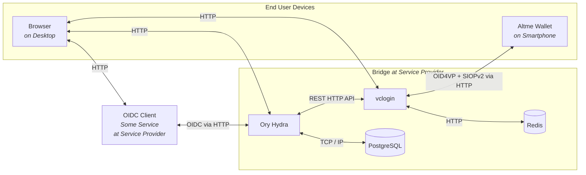
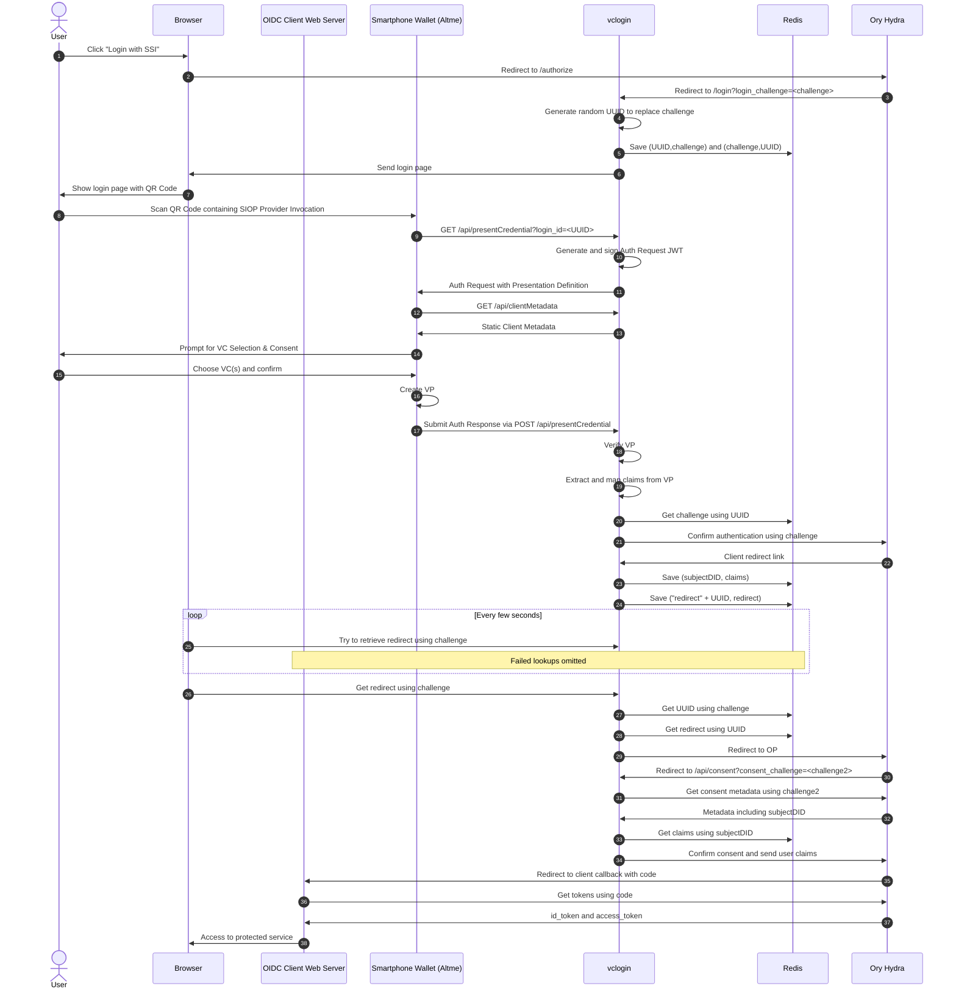

# Universal VC-to-OIDC Bridge

> [!WARNING]
> This repository is intended for prototyping and as a reference implementation.

> [!NOTE]
> This software artifact was originally intended to support only Gaia-X Participant Credentials. It has since evolved to be fully configurable for almost any Verifiable Credential, almost any wallet application, and almost any current OIDC client.

## Overview

This bridge allows you to use established OIDC flows to authenticate and authorize users that have W3C Verifiable Credentials. As a contribution to Gaia-X infrastructure, the ultimate goal here is to enable users to use their Gaia-X Participant Credentials to access systems while making integration simpler through using established SSO protocols. The bridge can also be configured to use other Verifiable Credentials.

## Architecture

There are two main components to this project and some additional containers for monitoring and databases. A company (or at least a small consortium) wanting to support SSI in their existing (or new) systems, is expected to run this full setup to avoid introducing a middle man:


*Note: In a deployment, external HTTP interfaces should be using HTTPS instead.*
*Note: While we test with Altme Wallet, any SSI wallet supporting OID4VP + SIOPv2 works.*


### OIDC Provider: Ory Hydra

Hydra is a FOSS and OpenID certified implementation. It should allow any OIDC or OAuth2 client to leverage it as an IdP. For development, it has the advantage of giving us freedom to build a custom login process, as we can specify arbitrary redirects.

### VC Login Service

This custom Next.js web app provides a user frontend for the login process, as well as necessary backend API routes. It handles the Verifiable Presentation exchange with the wallet, the verification of Verifiable Presentations and of the Verifiable Credentials inside, and the extraction and remapping of claims.


## Login Flow

The user's browser starts out on the service website, which takes the role of an OIDC client here. The flow is slightly simplified for improved readability. For example, the responses for Redis lookups are not shown. Also, redirects are shown immediately going to the redirect target. This is an authorization code flow:



## Running a Local Deployment

> [!WARNING]
> You need to use a tool like ngrok for testing so your smartphone wallet can access the vclogin backend. However, it can lead to issues with `application/x-www-form-urlencoded` request bodies used in the flow (https://ngrok.com/docs/ngrok-agent/changelog/#changes-in-22). But you can manually replay that request on ngrok interface, if you run into problems.

1. `$ ngrok http 5002`, which will set up a randomly generated URL
2. enter the domain for the vclogin service into the env file `/vclogin/.env` with key `EXTERNAL_URL`
3. enter a JWK key (Ed25519) into the env file `./vclogin/.env` with key `EXTERNAL_URL` (example for quick testing: `{"kty":"OKP","crv":"Ed25519","x":"cwa3dufHNLg8aQb2eEUqTyoM1cKQW3XnOkMkj_AAl5M","d":"me03qhLByT-NKrfXDeji-lpADSpVOKWoaMUzv5EyzKY"}`)
4. enter the path to a trust policy file into the env file `/vclogin/.env` with key `TRUST_POLICY` (example for quick testing: `./__tests__/testdata/policies/acceptAnything.json`)
5. `$ docker compose up`

To validate running bridge with a simple OIDC client:
1. `$ ./test_client.sh`
2. go to `http://localhost:9010` in browser
3. download Altme Wallet (and set up new wallet)
4. follow the login flow and present your Account Ownership VC generated on Altme startup
5. end up at `http://localhost:9010/callback` with metadata about the login being displayed


## Running for Development
The repository comes with a VSCode devcontainer configuration. We recommend using it. To prepare your VSCode setup, you need two settings files.

`./.vscode/settings.json` contains:
```
{
  "eslint.workingDirectories": ["./vclogin"]
}
```

`./vclogin/.vscode/settings.json` contains:
```
{
  "prettier.prettierPath": "./node_modules/prettier"
}
```

To develop the vclogin service, follow these steps:

1. `$ ngrok http 5002`, which will set up a randomly generated URL
2. create the file `./vclogin/env.local`

```
HYDRA_ADMIN_URL=http://localhost:5001
REDIS_HOST=localhost
REDIS_PORT=6379
NODE_TLS_REJECT_UNAUTHORIZED=0
TRUST_POLICY=./__tests__/testdata/policies/acceptAnything.json
EXTERNAL_URL=<ngrok url>
DID_KEY_JWK=<Ed25519 JWK>
```

3. `$ docker compose up`
4. `$ docker compose stop vclogin`
5. in `vclogin` directory: `$ npm run dev`

Now you can develop and it will hot-reload.


## Policy Configuration

TODO


## Token Introspection

Look into the access token like this:

```
$ docker run --rm -it \
    --network ory-hydra-net \
    oryd/hydra:v2.2.0 \
    introspect token --skip-tls-verify \
    --format json-pretty \
    -e http://hydra:4445 \
    TOKEN
```

Example result:

```
{
  "active": true,
  "client_id": "10c75c26-423f-4b3e-9b2c-677d7337db9e",
  "exp": 1701437721,
  "ext": {
    "email": "test@test.com",
    "ethereumAddress": "0x4C84a36fCDb7Bc750294A7f3B5ad5CA8F74C4A52",
    "hasCountry": "GER",
    "hasJurisdiction": "GER",
    "hasLegallyBindingName": "deltaDAO AG",
    "hasRegistrationNumber": "DEK1101R.HRB170364",
    "hash": "9ecf754ffdad0c6de238f60728a90511780b2f7dbe2f0ea015115515f3f389cd",
    "id": "did:key:z6MkkdC46uhBGjMYS2ZDLUwCrTWdaqZdTD3596sN4397oRNd",
    "leiCode": "391200FJBNU0YW987L26",
    "name": "Name Surname",
    "surname": "Surname",
    "title": "CEO",
    "type": "EmployeeCredential"
  },
  "iat": 1701434120,
  "iss": "http://localhost:5004/",
  "nbf": 1701434120,
  "scope": "openid offline",
  "sub": "did:key:z6MkkdC46uhBGjMYS2ZDLUwCrTWdaqZdTD3596sN4397oRNd",
  "token_type": "Bearer",
  "token_use": "access_token"
}
```

## Relevant Standards

TODO
