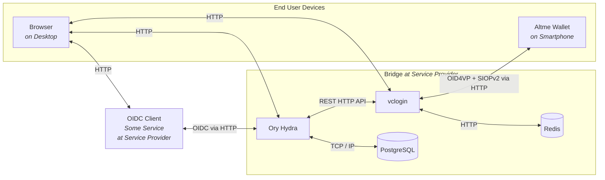
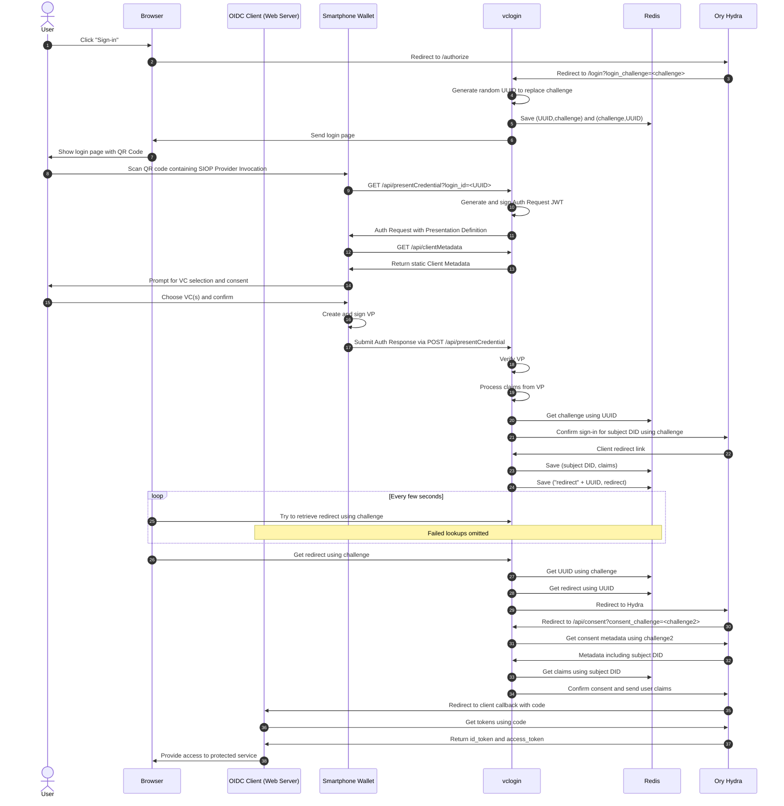

# Universal SSI-to-OIDC Bridge for VC-based Sign-ins


> [!WARNING]
> This repository is intended for prototyping and as a reference implementation.

> [!NOTE]
> A preprint of our paper providing more bacckground information is available [on arXiv](https://arxiv.org/abs/2401.09488).

> [!NOTE]
> This software artifact was originally intended to support only Gaia-X Participant Credentials. It has since evolved to be fully configurable for almost any Verifiable Credential, almost any wallet application, and almost any current OIDC client.

## Overview

### The Problem Statement

You operate a service and want to allow your users to sign-in using Verifiable Credentials from a mobile wallet. But building that takes considerable time and expertise.

### The Solution

A service provider can run this dockerized bridge software, that acts as a normal OIDC Provider towards the service. That means, any service supporting OIDC or OAuth 2.0 for sign-ins can immediately be upgraded to accept sign-ins with Verifiable Credentials. When setting up the bridge software, you can configure what Verifiable Credentials are accepted and how the data within is put into `id_token` or `access_token`.

As a contribution to Gaia-X infrastructure, the ultimate goal here is to enable users to use their Gaia-X Participant Credentials to access systems, while making integration simpler through using established SSO protocols. The bridge can also be configured to use other Verifiable Credentials.

## Architecture

There are two main components to this project and some additional containers for monitoring and databases. A company (or at least a small consortium) wanting to support SSI in their existing (or new) systems, is expected to run this full setup to avoid introducing a middle man:



_Note: In a deployment, external HTTP interfaces should be using HTTPS instead._
_Note: While we test with Altme Wallet, any SSI wallet supporting OID4VP + SIOPv2 works._

### OIDC Provider: Ory Hydra

Hydra is a FOSS and OpenID certified implementation. It should allow any OIDC or OAuth2 client to leverage it as an IdP. For development, it has the advantage of giving us freedom to build a custom login process, as we can specify arbitrary redirects.

### VC Login Service

This custom Next.js web app provides a user frontend for the login process, as well as necessary backend API routes. It handles the Verifiable Presentation exchange with the wallet, the verification of Verifiable Presentations and of the Verifiable Credentials inside, and the extraction and remapping of claims.

## Login Flow

The user's browser starts out on the service website, which takes the role of an OIDC client here. The flow is slightly simplified for improved readability. For example, the responses for Redis lookups are not shown. Also, redirects are shown immediately going to the redirect target. This is an authorization code flow:



## Running a Local Deployment

A local deployment is a great way to test the bridge and to use it for prototyping an OIDC client service you are developing.

> [!IMPORTANT]
> You need to use a tool like ngrok for testing so your smartphone wallet can access the vclogin backend. However, it can lead to issues with `application/x-www-form-urlencoded` request bodies used in the flow (https://ngrok.com/docs/ngrok-agent/changelog/#changes-in-22). But you can manually replay that request on the ngrok interface, if you run into problems.

1. `$ ngrok http 5002`, which will set up a randomly generated URL
2. enter the domain for the vclogin service into the env file `/vclogin/.env` with key `EXTERNAL_URL`
3. enter a JWK key (Ed25519) into the env file `./vclogin/.env` with key `DID_KEY_JWK` (example for quick testing: `{"kty":"OKP","crv":"Ed25519","x":"cwa3dufHNLg8aQb2eEUqTyoM1cKQW3XnOkMkj_AAl5M","d":"me03qhLByT-NKrfXDeji-lpADSpVOKWoaMUzv5EyzKY"}`)
4. enter the path to a login policy file into the env file `/vclogin/.env` with key `LOGIN_POLICY` (example for quick testing: `./__tests__/testdata/policies/acceptAnything.json`)
5. OPTIONAL: enter an override for a credential descriptor into the env file `/vclogin/.env` with key `PEX_DESCRIPTOR_OVERRIDE` if direct control over what wallets are asked for is desired (example for quick testing: `./__tests__/pex/testdata/descriptorEmailFromAltme.json`)
6. at this point it needs to be ensured that the container for the vclogin service is freshly built with the new env file: `docker compose down && docker compose build`
7. `$ docker compose up`

To validate the running bridge with a simple OIDC client:

> [!NOTE]
> You might run into a "Permisson denied" issue when running the shell script `./test_client.sh`. You need to mark the file as executable using `chmod +x ./test_client.sh`.

1. `$ ./test_client.sh`
2. go to `http://localhost:9010` in browser
3. download Altme Wallet and set up the (new) wallet
4. to make sure you have a credential for testing, click on the "Discover" tab at the bottom and get a "Proof of email" credential
5. in your browser, click on "Authorize" and scan the QR code with Altme wallet
6. the wallet will prompt you with a list of possible credentials to present, from which you choose one and confirm
7. the wallet will show a success message
8. within seconds, the browser should redirect
9. end up at `http://localhost:9010/callback` with metadata about the login being displayed

> [!TIP]
> If you want to understand what the wallet is doing in the exchange, go to settings and toggle on "Developer Mode". After scanning a QR code, the wallet will now give you the option to see or save the interaction data. If you just want to continue the sign-in, tap "skip".

## Running for Development

Running for development means that all components apart from the vclogin service will run containerized. The vclogin service can be edited and run with hot-reload for fast testing and iteration.

The repository comes with a VSCode devcontainer configuration. We recommend using it. To prepare your VSCode setup, you need two settings files.

`./.vscode/settings.json` contains:

```json
{
  "eslint.workingDirectories": ["./vclogin"]
}
```

`./vclogin/.vscode/settings.json` contains:

```json
{
  "prettier.prettierPath": "./node_modules/prettier"
}
```

To develop the vclogin service, follow these steps:

1. `$ ngrok http 5002`, which will set up a randomly generated URL
2. create the file `./vclogin/.env.local`

```bash
HYDRA_ADMIN_URL=http://localhost:5001
REDIS_HOST=localhost
REDIS_PORT=6379
NODE_TLS_REJECT_UNAUTHORIZED=0
LOGIN_POLICY=./__tests__/testdata/policies/acceptAnything.json
PEX_DESCRIPTOR_OVERRIDE=./__tests__/testdata/pex/descriptorAnything.json
EXTERNAL_URL=<ngrok url>
DID_KEY_JWK=<Ed25519 JWK>
```

_Note: The PEX_DESCRIPTOR_OVERRIDE is optional and provides a way to override the automatic descriptor generation._

3. `$ docker compose up`
4. `$ docker compose stop vclogin`
5. in `vclogin` directory upon first checkout: `$ npm i`
6. in `vclogin` directory: `$ npm run dev`

Now you can develop and it will hot-reload.

## Policy Configuration

The login policy is the one configuration file that configures the bridge's behavior. The most simple example of one looks like this and accepts any credential, while forwarding all subject fields to the `access_token`:

```JSON
[
  {
    "credentialID": "credential1",
    "patterns": [
      {
        "issuer": "*",
        "claims": [
          {
            "claimPath": "$.credentialSubject.*",
            "newPath": "$.subjectData",
            "required": false
          }
        ]
      }
    ]
  }
]
```

A login policy is always an array of objects that represent expected Verifiable Credentials. For each expected credential, we have to specify a unique ID used for internal tracking. We also need to provide an array of pattern objects, describing how the credential looks like and how its values are used.

A pattern object has the following fields:

- `claimPath` is a JSONPath that points to one or more values in the credential. If it points to multiple values, they will be aggregated in a new object and indexed by just their final JSONPath component. _This is generally convenient, but can lead to values being overwritten if not careful and working with a credential that uses the same path components in different depths._
- `newPath` is the new path of the value relative to the root of the token it will be written into. This value is optional, as long as `claimPath` points to exactly one value. In that case, it defaults to `$.<final claimPath component>`.
- `token` optionally defines if the claim value ends up either in `"id_token"` or `"access_token"`, with the latter being the default.
- `required` is optional and defaults to `false`

## Token Introspection

Look into the access token like this:

```bash
$ docker run --rm -it \
    --network ory-hydra-net \
    oryd/hydra:v2.2.0 \
    introspect token --skip-tls-verify \
    --format json-pretty \
    -e http://hydra:4445 \
    TOKEN
```

## Relevant Standards

- [OpenID Connect Core](https://openid.net/specs/openid-connect-core-1_0.html)
- [OpenID for Verifiable Presentations](https://openid.net/specs/openid-4-verifiable-presentations-1_0-ID2.html)
- [Self-Issued OpenID Provider v2](https://openid.net/specs/openid-connect-self-issued-v2-1_0.html)
- [Verifiable Credentials Data Model v1.1](https://www.w3.org/TR/vc-data-model/)
- [DIF Presentation Definition](https://identity.foundation/presentation-exchange/spec/v2.0.0/#presentation-definition)
